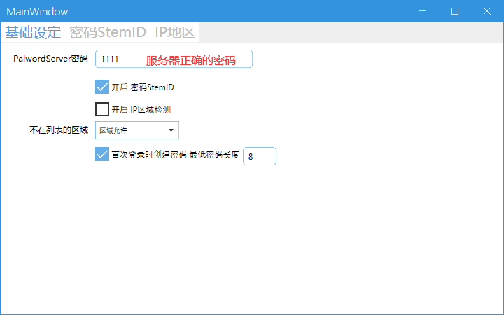

# PalwordAuthorize
幻兽帕鲁 对SteamID做授权 palworld

## 功能介绍
需要为帕鲁服务器设置一个密码，然后才能使用SteamID密码功能 
根据用户输入不同的密码进入SteamID 
例如输入密码1111是角色A，输入密码2222是角色B 

可对密码设置过期时间，如果超过设定时间既无法登录角色 
既不需要关闭客户端就能切换帐号，也可作为SteamID授权用 

同时 可以禁止或者只允许某个国家的IP进入服务器 

## 使用方法

你可以从以下链接下载最新版本的发布包：
[下载最新 Release](https://github.com/mudebug77/PalwordAuthorize/releases/latest)

拷贝mudebug到 <UE4SS install>/Mods/mudebug 
最终路径 server\Pal\Binaries\Win64\Mods\mudebug\LConfig.txt 
修改Mods/mods.txt 文件增加一行 mudebug : 1 

启动 PalwordAuthorize\PalwordAuthorize.exe 修改SteamID为你需要的ID 

如果你需要定制其他功能可以私我
如果这个项目对你有帮助可以打赏与支持我

